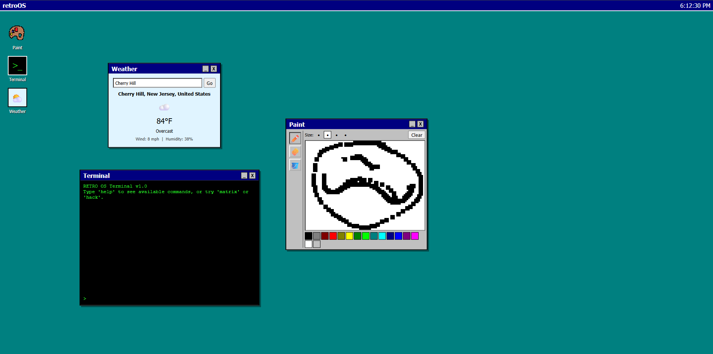

# retroOS

A personal web-based operating system built from scratch with HTML, CSS, and JavaScript — no frameworks, no libraries. Built for Hack Club's [webOS Mission](https://jams.hackclub.com/batch/webOS).

## What it is

retroOS is a fake desktop that lives entirely in your browser. It boots into a Windows 95–styled desktop with a live clock, draggable/closable/minimizable windows, a taskbar, and a handful of working apps.

## Features

- **Win95-style window system** — every app opens in a draggable, closable, minimizable window with its own title bar, built from a reusable `.window` / `.windowheader` CSS system
- **Taskbar** — minimized windows collapse into the taskbar at the bottom of the screen and restore on click; clicking any window brings it to the front (z-index stacking)
- **Live clock** — updates every second in the top bar
- **Paint** — a pixel-art drawing app with pencil/eraser/fill tools, adjustable brush size, a 16-color classic palette, and a Clear button. Drawing snaps to a pixel grid for a chunky retro look instead of smooth lines
- **Terminal** — a real command-line interpreter with custom commands:
  - `help`, `about`, `whoami`, `projects`, `date`, `clear`, `echo [text]`
  - `ascii` — prints an ASCII art banner
  - `fortune` — random dev-themed one-liners
  - `matrix` — fake Matrix-style binary rain (type `stop` to exit)
  - `hack [target]` — a goofy fake hacking sequence
  - `theme [color]` — changes the terminal's color scheme live (green/amber/blue/red/white)
- **Weather** — fetches **real, live weather data** for any city you type in, using the free [Open-Meteo](https://open-meteo.com/) API (geocoding + current conditions: temperature, conditions, wind, humidity). No API key required.

## Tech

Plain HTML, CSS, and vanilla JavaScript. No build step, no frameworks, no dependencies.

- `index.html` — structure/markup for the desktop and all app windows
- `style.css` — shared window/UI styling
- `script.js` — dragging, window management, taskbar, and all app logic (Paint canvas drawing, Terminal command parsing, Weather API calls)

## Running it locally

1. Clone or download this repo
2. Open `index.html` with [Live Server](https://marketplace.visualstudio.com/items?itemName=ritwickdey.LiveServer) in VS Code (or any local static server)
3. No build step, no installs required

## Why retroOS

Built as a personal project to learn DOM manipulation, the Canvas API, async/await + fetch for real network requests, and basic UI/UX design — all without relying on any framework.
